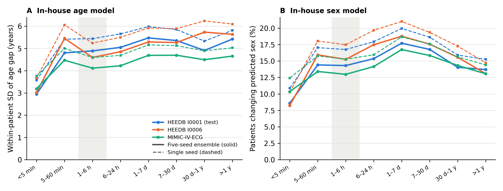
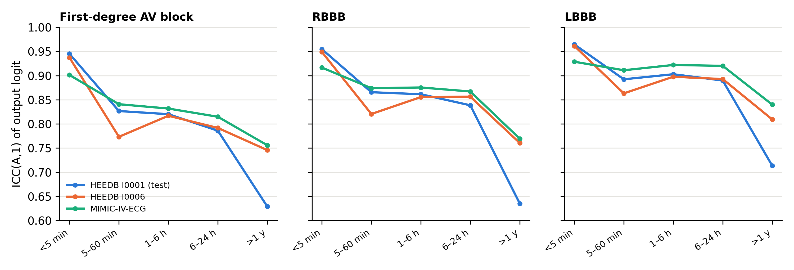
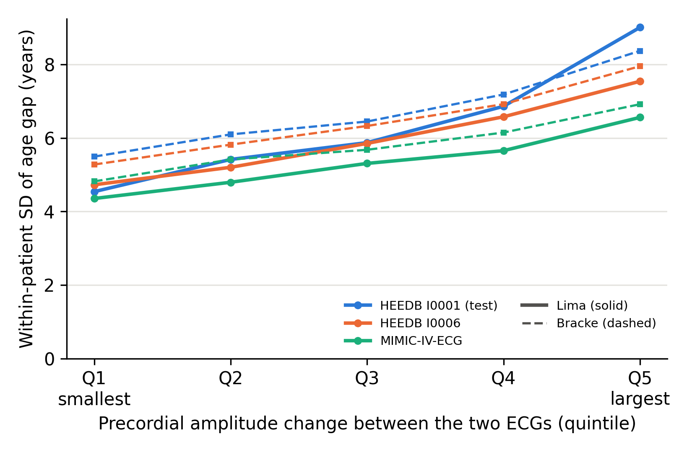

All values are computed from aggregate outputs of the analysis code. Abbreviations: *S*~w~, within-patient standard deviation; RC, repeatability coefficient (2.77·*S*~w~); LoA, 95% limits of agreement; ICC, two-way random-effects absolute-agreement single-measure intraclass correlation; MAE, mean absolute error; RBBB/LBBB, right/left bundle branch block. Cohorts: I0001, HEEDB I0001 test patients (Massachusetts General Hospital); I0006, HEEDB I0006 (Emory University Hospital); MIMIC, MIMIC-IV-ECG; MIMIC ED, troponin-negative emergency subcohort.

## Supplementary Methods

### S1. Pair construction and signal quality

For each patient, ECGs were ordered by acquisition time and record identifier, and each record was paired with the next record of the same patient. Pairs with identical acquisition times were discarded. Each pair was assigned to one of eight interval strata. Within a stratum, one pair per patient was kept by the smallest hash of the concatenated record identifiers, and at most 25 000 patients per stratum and cohort were kept by the smallest hash of the patient identifier. Both hashes are deterministic, so the sample is reproducible. In HEEDB I0001, only patients in the database's test split were used; models were trained only on training-split patients.

Signals were read in physical units (mV) with the WFDB library. A record was excluded if:
- the 12 standard leads, a 10-second duration (±0.05 s), or millivolt units were missing;
- any sample was non-finite;
- any lead had an SD below 0.005 mV;
- any absolute amplitude exceeded 20 mV.

The lead-wise median was subtracted. For the in-house models, signals were resampled to 250 Hz (2500 samples). For the published models, they were resampled to 400 Hz (polyphase resampling), truncated to 4000 samples, and zero-padded symmetrically to 4096.

**Duplicate waveforms.** Two records were treated as duplicates when the MD5 hashes of their 250-Hz signals, quantised to 0.005 mV, were equal, or when their 40-ms block means differed by less than 0.01 mV in every lead.

### S2. Models

**In-house models.** One-dimensional residual convolutional network:
- four residual blocks with 32, 64, 128, and 256 channels and stride 2;
- kernel sizes 7 and 5, group normalisation, and SiLU activation;
- global average pooling and a linear head.

Inputs were divided by a fixed lead-wise RMS scale estimated in training patients. Training details:
- 298 542 adult I0001 training patients with valid signals (one ECG each, consistent recorded sex);
- AdamW (weight decay 10⁻⁴), one-cycle learning rate (maximum 2×10⁻³), 12 epochs, batch size 512, bfloat16 mixed precision;
- the best epoch selected in 19 896 validation patients: lowest mean absolute error for age, highest AUC for sex.

Five seeds were trained for each task. Validation mean absolute error for age was 7.65–7.67 years; validation AUC for sex was 0.960–0.961. Secondary sex models using only the limb or only the precordial leads were trained earlier on 100 000 patients and were used without change.

**Published models.**

| Model | Training data | Input | Choice made in I0001 validation patients | Validation result |
| --- | --- | --- | --- | --- |
| Lima *et al.* 2021, ECG age | CODE (Brazil) | 400 Hz, 4096 samples | amplitude ×1 vs ×10 | ×1: MAE 10.4 y, r 0.73; ×10: MAE 14.7 y |
| Bracke *et al.* 2026, ECG age | CODE-15% (Brazil) | 400 Hz, 4096 samples, recorded sex | none | MAE 8.3 y, r 0.82 (published CODE-15%: 6.72 y, 0.9) |
| Ribeiro *et al.* 2020, abnormalities | CODE (Brazil) | 400 Hz, 4096 samples | amplitude ×1 vs ×10 | ×1 mean AUC 0.983; ×10 0.968 |

Validation used 5000 I0001 validation patients (4981 with valid signals). The Bracke model was run with mamba-ssm installed without its CUDA extension, through the library's Triton-kernel path (`use_mem_eff_path=False`). This path computes the same function as the fused kernel. All weights loaded with no missing or unexpected parameters. Per-class validation AUCs of the Ribeiro model against GE 12SL v24 statements were First-degree AV block 0.986, RBBB 0.998, LBBB 0.999, Sinus bradycardia 0.930, Atrial fibrillation 0.988, Sinus tachycardia 0.996.

### S3. Signal descriptors

- **Heart rate and RR-interval coefficient of variation:** from QRS detection on lead II (WFDB XQRS).
- **High-frequency and baseline power:** fractions of spectral power above 40 Hz and below 0.5 Hz; the median across leads.
- **Lead RMS:** root-mean-square amplitude per lead.
- **Amplitude change between ECGs:** the mean absolute log ratio of lead RMS, computed for leads I and II (limb) and V1–V6 (precordial).

### S4. Electrode-reversal detection

For each pair, a median beat was formed for each ECG from beats detected on a multilead energy envelope (window −250 to +450 ms; baseline set to the first 40 ms). Limb-electrode permutations were applied to the second ECG through Einthoven's relations on leads I and II:

| Permutation | Lead I' | Lead II' |
| --- | --- | --- |
| RA ↔ LA | −I | II − I |
| LA ↔ LL | II | I |
| RA ↔ LL | I − II | −II |
| RA→LA→LL→RA | II − I | −I |
| RA→LL→LA→RA | −II | I − II |

Each transformed beat was compared with the first ECG's beat after optimal scalar gain and a shift of up to ±20 ms. The ratio of the best permutation's relative residual to the identity residual was the limb score; a pair was flagged if the score was below 0.8. The same was done for the five adjacent precordial transpositions (V1↔V2 … V5↔V6), with a threshold of 0.7. Thresholds were chosen against MIMIC machine statements and applied unchanged to HEEDB (*Table S8*).

### S5. Agreement statistics

For paired values *a*~i~, *b*~i~ in *n* patients:
- within-patient SD: *S*~w~ = SD(*b* − *a*)/√2;
- repeatability coefficient: 2.77·*S*~w~ (= 1.96·√2·*S*~w~);
- limits of agreement: mean(*b* − *a*) ± 1.96·SD(*b* − *a*).

ICC(A,1) was computed from two-way ANOVA mean squares for rows (MSR), columns (MSC), and error (MSE):

ICC(A,1) = (MSR − MSE) / (MSR + MSE + 2(MSC − MSE)/*n*).

Cohen's κ was computed for binary calls. All 95% confidence intervals are percentile intervals from 2000 bootstrap resamples of patients; each patient contributed one pair per stratum. For the age gap at the second ECG, chronological age was advanced by the interval between ECGs.

### S6. Protocol and deviations

The analysis protocol was written before model outputs were computed and is kept with the code together with a dated change log.

**Changes made before results were seen:**
- implementation of duplicate detection;
- the 18–89-year age window;
- in-house model training details;
- the published-model amplitude multiplier;
- the three-ECG analysis.

**Analyses added after the primary results (post hoc):**
- signal change by interval;
- age-gap variability by quintile of precordial amplitude change;
- signal-similar 1–6-hour pairs;
- sex outputs restricted to adults;
- artifact and electrode-reversal analyses;
- the age-bias-corrected gap.

**Models added after the primary results:** the second published ECG-age model and the abnormality classifier, added to test whether the findings depend on a single published model. Their analyses were specified before their outputs were computed.

## Supplementary Tables

**Table S1. Pair flow by cohort and interval.**

| Cohort | Interval | Pairs sampled | Both ECGs valid | Duplicates removed | Age analyses | Sex analyses | Median interval (min) |
| --- | --- | ---: | ---: | ---: | ---: | ---: | ---: |
| I0001 | <5 min | 25 000 | 24 004 | 0 | 19 106 | 23 990 | 0.9 |
| I0001 | 5–60 min | 24 626 | 23 888 | 0 | 17 393 | 23 838 | 23.0 |
| I0001 | 1–6 h | 25 000 | 24 525 | 0 | 17 409 | 24 467 | 190.2 |
| I0001 | 6–24 h | 25 000 | 23 974 | 0 | 15 194 | 23 919 | 819.6 |
| I0001 | 1–7 d | 25 000 | 23 737 | 0 | 14 426 | 23 680 | 3161.9 |
| I0001 | 7–30 d | 25 000 | 24 014 | 0 | 15 785 | 23 959 | 21631.0 |
| I0001 | 30 d–1 y | 25 000 | 24 017 | 1 | 15 792 | 23 966 | 185650.2 |
| I0001 | >1 y | 25 000 | 23 741 | 0 | 13 697 | 23 682 | 1560431.8 |
| I0006 | <5 min | 17 310 | 16 438 | 0 | 15 513 | 16 423 | 0.8 |
| I0006 | 5–60 min | 10 011 | 9 802 | 0 | 9 401 | 9 788 | 19.4 |
| I0006 | 1–6 h | 22 762 | 22 623 | 0 | 21 507 | 22 605 | 212.0 |
| I0006 | 6–24 h | 25 000 | 24 894 | 0 | 23 446 | 24 881 | 912.3 |
| I0006 | 1–7 d | 25 000 | 24 892 | 0 | 23 505 | 24 839 | 3494.7 |
| I0006 | 7–30 d | 25 000 | 24 907 | 0 | 23 636 | 24 723 | 21491.2 |
| I0006 | 30 d–1 y | 25 000 | 24 909 | 0 | 23 507 | 24 151 | 221029.8 |
| I0006 | >1 y | 25 000 | 24 915 | 0 | 23 618 | 24 054 | 940127.6 |
| MIMIC | <5 min | 7 416 | 6 548 | 0 | 6 026 | 6 546 | 1.0 |
| MIMIC | 5–60 min | 12 498 | 11 832 | 0 | 10 848 | 11 831 | 24.0 |
| MIMIC | 1–6 h | 25 000 | 24 124 | 15 | 22 532 | 24 107 | 199.0 |
| MIMIC | 6–24 h | 25 000 | 24 114 | 0 | 22 413 | 24 109 | 717.0 |
| MIMIC | 1–7 d | 25 000 | 24 018 | 0 | 22 236 | 24 016 | 3431.0 |
| MIMIC | 7–30 d | 25 000 | 24 231 | 0 | 22 831 | 24 230 | 21533.0 |
| MIMIC | 30 d–1 y | 25 000 | 24 400 | 0 | 23 087 | 24 398 | 175556.5 |
| MIMIC | >1 y | 25 000 | 24 454 | 0 | 23 675 | 24 452 | 1100431.5 |
| MIMIC ED | 1–6 h | 3 911 | 3 911 | 5 | 3 780 | 3 906 | 280.0 |

**Table S2a. Age-gap agreement, Lima *et al.* model.**

| Cohort | Interval | n | *S*~w~, y (95% CI) | RC, y | Bias (LoA), y | ICC age gap (95% CI) | ICC predicted age | Class change >8 y, % (95% CI) | κ | MAE first ECG, y |
| --- | --- | ---: | ---: | ---: | ---: | ---: | ---: | ---: | ---: | ---: |
| I0001 | <5 min | 19 106 | 3.74 (3.66–3.82) | 10.4 | -0.3 (-10.7, 10.1) | 0.92 (0.92–0.92) | 0.94 | 10.8 (10.3–11.2) | 0.76 | 10.7 |
| I0001 | 5–60 min | 17 393 | 6.19 (6.09–6.30) | 17.2 | -0.6 (-17.8, 16.5) | 0.80 (0.79–0.80) | 0.83 | 17.7 (17.1–18.3) | 0.63 | 11.3 |
| I0001 | 1–6 h | 17 409 | 6.52 (6.41–6.64) | 18.1 | -0.7 (-18.8, 17.4) | 0.77 (0.76–0.77) | 0.82 | 18.6 (18.1–19.2) | 0.60 | 11.0 |
| I0001 | 6–24 h | 15 194 | 7.07 (6.96–7.18) | 19.6 | -0.7 (-20.3, 18.9) | 0.74 (0.73–0.74) | 0.78 | 20.5 (19.8–21.2) | 0.55 | 11.1 |
| I0001 | 1–7 d | 14 426 | 7.77 (7.64–7.89) | 21.5 | -0.2 (-21.7, 21.4) | 0.68 (0.67–0.69) | 0.73 | 22.6 (21.9–23.3) | 0.50 | 11.0 |
| I0001 | 7–30 d | 15 785 | 7.55 (7.44–7.65) | 20.9 | 0.3 (-20.6, 21.2) | 0.66 (0.65–0.67) | 0.74 | 22.7 (22.0–23.3) | 0.49 | 10.3 |
| I0001 | 30 d–1 y | 15 792 | 7.00 (6.89–7.10) | 19.4 | 0.2 (-19.2, 19.6) | 0.68 (0.67–0.69) | 0.79 | 21.5 (20.8–22.1) | 0.51 | 10.0 |
| I0001 | >1 y | 13 697 | 7.52 (7.39–7.65) | 20.8 | -0.9 (-21.8, 19.9) | 0.60 (0.59–0.62) | 0.73 | 24.2 (23.5–24.9) | 0.44 | 9.7 |
| I0006 | <5 min | 15 513 | 4.06 (3.98–4.15) | 11.3 | -0.1 (-11.4, 11.1) | 0.91 (0.90–0.91) | 0.92 | 12.3 (11.8–12.8) | 0.74 | 10.9 |
| I0006 | 5–60 min | 9 401 | 7.19 (7.03–7.35) | 19.9 | 0.7 (-19.2, 20.6) | 0.74 (0.73–0.75) | 0.75 | 20.5 (19.7–21.3) | 0.58 | 11.4 |
| I0006 | 1–6 h | 21 507 | 6.07 (5.98–6.15) | 16.8 | -0.4 (-17.2, 16.4) | 0.80 (0.79–0.81) | 0.79 | 19.2 (18.6–19.7) | 0.61 | 11.8 |
| I0006 | 6–24 h | 23 446 | 6.47 (6.39–6.55) | 17.9 | 0.1 (-17.8, 18.0) | 0.78 (0.77–0.78) | 0.75 | 20.4 (19.9–20.9) | 0.59 | 12.0 |
| I0006 | 1–7 d | 23 505 | 7.19 (7.10–7.27) | 19.9 | 0.3 (-19.6, 20.2) | 0.73 (0.73–0.74) | 0.72 | 22.1 (21.6–22.7) | 0.55 | 11.9 |
| I0006 | 7–30 d | 23 636 | 7.25 (7.16–7.33) | 20.1 | -0.1 (-20.2, 20.0) | 0.72 (0.71–0.73) | 0.74 | 22.4 (21.9–23.0) | 0.54 | 11.4 |
| I0006 | 30 d–1 y | 23 507 | 7.47 (7.36–7.57) | 20.7 | -0.0 (-20.7, 20.7) | 0.70 (0.69–0.71) | 0.73 | 22.0 (21.5–22.6) | 0.53 | 10.8 |
| I0006 | >1 y | 23 618 | 7.36 (7.26–7.46) | 20.4 | -0.5 (-20.9, 19.9) | 0.68 (0.67–0.69) | 0.74 | 21.1 (20.5–21.6) | 0.52 | 10.1 |
| MIMIC | <5 min | 6 026 | 4.25 (4.12–4.38) | 11.8 | -0.4 (-12.2, 11.4) | 0.88 (0.88–0.89) | 0.90 | 12.3 (11.5–13.1) | 0.73 | 10.3 |
| MIMIC | 5–60 min | 10 848 | 5.57 (5.43–5.71) | 15.4 | -0.6 (-16.1, 14.8) | 0.81 (0.80–0.82) | 0.85 | 16.3 (15.6–17.0) | 0.66 | 10.8 |
| MIMIC | 1–6 h | 22 532 | 5.39 (5.32–5.47) | 14.9 | -0.5 (-15.4, 14.5) | 0.81 (0.80–0.81) | 0.86 | 17.5 (17.1–18.0) | 0.63 | 10.3 |
| MIMIC | 6–24 h | 22 413 | 5.59 (5.51–5.66) | 15.5 | -0.3 (-15.8, 15.2) | 0.79 (0.78–0.79) | 0.85 | 17.7 (17.2–18.2) | 0.61 | 10.0 |
| MIMIC | 1–7 d | 22 236 | 6.21 (6.14–6.29) | 17.2 | -0.4 (-17.6, 16.9) | 0.75 (0.74–0.75) | 0.81 | 19.8 (19.3–20.4) | 0.57 | 10.1 |
| MIMIC | 7–30 d | 22 831 | 6.22 (6.15–6.30) | 17.2 | 0.2 (-17.1, 17.4) | 0.74 (0.73–0.75) | 0.81 | 19.9 (19.4–20.5) | 0.56 | 10.0 |
| MIMIC | 30 d–1 y | 23 087 | 5.92 (5.85–5.99) | 16.4 | 0.1 (-16.3, 16.6) | 0.75 (0.74–0.75) | 0.84 | 19.3 (18.8–19.8) | 0.56 | 9.5 |
| MIMIC | >1 y | 23 675 | 6.08 (6.02–6.16) | 16.9 | -0.3 (-17.1, 16.6) | 0.72 (0.71–0.73) | 0.82 | 20.1 (19.6–20.6) | 0.53 | 9.2 |
| MIMIC ED | 1–6 h | 3 780 | 4.73 (4.58–4.89) | 13.1 | -0.5 (-13.6, 12.6) | 0.83 (0.82–0.84) | 0.89 | 16.8 (15.7–18.0) | 0.63 | 9.8 |

**Table S2b. Age-gap agreement, Bracke *et al.* model.** ECGs with unknown or conflicting recorded sex were not scored by this model.

| Cohort | Interval | n | *S*~w~, y (95% CI) | RC, y | Bias (LoA), y | ICC age gap (95% CI) | ICC predicted age | Class change >8 y, % (95% CI) | κ | MAE first ECG, y |
| --- | --- | ---: | ---: | ---: | ---: | ---: | ---: | ---: | ---: | ---: |
| I0001 | <5 min | 19 104 | 4.16 (4.09–4.24) | 11.5 | -0.2 (-11.7, 11.4) | 0.87 (0.87–0.88) | 0.94 | 10.7 (10.2–11.1) | 0.69 | 9.0 |
| I0001 | 5–60 min | 17 393 | 6.47 (6.37–6.58) | 17.9 | -0.3 (-18.3, 17.6) | 0.74 (0.73–0.75) | 0.84 | 16.5 (16.0–17.1) | 0.56 | 9.7 |
| I0001 | 1–6 h | 17 408 | 6.79 (6.69–6.90) | 18.8 | -0.4 (-19.2, 18.5) | 0.69 (0.68–0.70) | 0.83 | 17.5 (16.9–18.1) | 0.50 | 9.4 |
| I0001 | 6–24 h | 15 193 | 7.22 (7.11–7.34) | 20.0 | -0.7 (-20.7, 19.4) | 0.64 (0.63–0.66) | 0.79 | 18.2 (17.6–18.9) | 0.45 | 9.3 |
| I0001 | 1–7 d | 14 425 | 7.66 (7.54–7.78) | 21.2 | -0.1 (-21.3, 21.1) | 0.59 (0.58–0.60) | 0.77 | 19.6 (19.0–20.3) | 0.41 | 9.1 |
| I0001 | 7–30 d | 15 782 | 7.34 (7.23–7.45) | 20.3 | 0.2 (-20.1, 20.6) | 0.57 (0.56–0.59) | 0.78 | 19.7 (19.1–20.4) | 0.41 | 8.5 |
| I0001 | 30 d–1 y | 15 790 | 6.62 (6.52–6.72) | 18.3 | 0.3 (-18.0, 18.7) | 0.59 (0.58–0.60) | 0.82 | 18.0 (17.4–18.6) | 0.41 | 8.0 |
| I0001 | >1 y | 13 697 | 6.81 (6.70–6.93) | 18.9 | -0.3 (-19.2, 18.6) | 0.53 (0.51–0.54) | 0.76 | 18.5 (17.8–19.2) | 0.36 | 7.5 |
| I0006 | <5 min | 15 503 | 4.17 (4.09–4.26) | 11.6 | -0.3 (-11.8, 11.3) | 0.87 (0.87–0.88) | 0.93 | 11.0 (10.6–11.5) | 0.68 | 9.0 |
| I0006 | 5–60 min | 9 393 | 7.17 (7.01–7.32) | 19.9 | -0.4 (-20.3, 19.4) | 0.68 (0.66–0.69) | 0.78 | 15.6 (14.8–16.3) | 0.53 | 9.5 |
| I0006 | 1–6 h | 21 498 | 6.53 (6.43–6.62) | 18.1 | 0.0 (-18.1, 18.1) | 0.72 (0.71–0.73) | 0.79 | 18.3 (17.8–18.8) | 0.55 | 9.5 |
| I0006 | 6–24 h | 23 442 | 7.00 (6.92–7.09) | 19.4 | -0.1 (-19.5, 19.4) | 0.69 (0.68–0.70) | 0.77 | 20.6 (20.0–21.1) | 0.51 | 9.7 |
| I0006 | 1–7 d | 23 498 | 7.56 (7.47–7.65) | 20.9 | 0.0 (-20.9, 20.9) | 0.65 (0.64–0.65) | 0.74 | 21.5 (20.9–22.0) | 0.48 | 9.7 |
| I0006 | 7–30 d | 23 623 | 7.47 (7.38–7.56) | 20.7 | -0.2 (-20.9, 20.5) | 0.63 (0.62–0.64) | 0.75 | 20.0 (19.5–20.5) | 0.49 | 9.2 |
| I0006 | 30 d–1 y | 23 484 | 7.50 (7.40–7.61) | 20.8 | 0.0 (-20.8, 20.8) | 0.60 (0.59–0.61) | 0.74 | 20.2 (19.7–20.7) | 0.47 | 8.7 |
| I0006 | >1 y | 23 597 | 7.17 (7.07–7.27) | 19.9 | -0.2 (-20.1, 19.6) | 0.58 (0.57–0.59) | 0.73 | 18.4 (17.9–18.8) | 0.44 | 8.1 |
| MIMIC | <5 min | 6 026 | 4.54 (4.41–4.69) | 12.6 | -0.4 (-13.0, 12.2) | 0.84 (0.83–0.85) | 0.91 | 12.3 (11.5–13.2) | 0.70 | 9.0 |
| MIMIC | 5–60 min | 10 848 | 6.02 (5.89–6.16) | 16.7 | -0.4 (-17.1, 16.3) | 0.73 (0.72–0.75) | 0.85 | 17.5 (16.8–18.2) | 0.58 | 9.2 |
| MIMIC | 1–6 h | 22 532 | 5.84 (5.76–5.92) | 16.2 | -0.2 (-16.4, 15.9) | 0.72 (0.72–0.73) | 0.86 | 18.1 (17.6–18.6) | 0.55 | 8.8 |
| MIMIC | 6–24 h | 22 413 | 6.02 (5.94–6.10) | 16.7 | -0.4 (-17.1, 16.2) | 0.70 (0.69–0.71) | 0.85 | 18.5 (18.0–19.0) | 0.51 | 8.6 |
| MIMIC | 1–7 d | 22 236 | 6.77 (6.68–6.86) | 18.8 | -0.5 (-19.3, 18.3) | 0.65 (0.64–0.66) | 0.82 | 20.0 (19.4–20.5) | 0.48 | 8.9 |
| MIMIC | 7–30 d | 22 831 | 6.62 (6.54–6.70) | 18.3 | -0.1 (-18.4, 18.3) | 0.65 (0.64–0.65) | 0.81 | 19.7 (19.2–20.3) | 0.48 | 8.6 |
| MIMIC | 30 d–1 y | 23 087 | 6.14 (6.06–6.22) | 17.0 | 0.3 (-16.7, 17.3) | 0.65 (0.64–0.66) | 0.85 | 19.5 (19.0–20.0) | 0.46 | 8.1 |
| MIMIC | >1 y | 23 675 | 6.23 (6.16–6.31) | 17.3 | 0.0 (-17.2, 17.3) | 0.62 (0.61–0.63) | 0.82 | 19.4 (18.9–19.9) | 0.42 | 7.7 |
| MIMIC ED | 1–6 h | 3 780 | 4.85 (4.70–4.99) | 13.4 | -0.2 (-13.6, 13.3) | 0.76 (0.75–0.78) | 0.87 | 16.0 (14.9–17.2) | 0.55 | 7.9 |

**Table S2c. Age-gap agreement, in-house five-seed ensemble.**

| Cohort | Interval | n | *S*~w~, y (95% CI) | RC, y | Bias (LoA), y | ICC age gap (95% CI) | ICC predicted age | Class change >8 y, % (95% CI) | κ | MAE first ECG, y |
| --- | --- | ---: | ---: | ---: | ---: | ---: | ---: | ---: | ---: | ---: |
| I0001 | <5 min | 19 106 | 2.95 (2.88–3.01) | 8.2 | -0.2 (-8.4, 8.0) | 0.91 (0.91–0.92) | 0.96 | 8.3 (8.0–8.8) | 0.76 | 7.8 |
| I0001 | 5–60 min | 17 393 | 4.80 (4.70–4.90) | 13.3 | -0.4 (-13.7, 13.0) | 0.80 (0.79–0.81) | 0.89 | 14.0 (13.4–14.5) | 0.63 | 8.3 |
| I0001 | 1–6 h | 17 409 | 4.89 (4.79–4.99) | 13.5 | -0.1 (-13.7, 13.4) | 0.78 (0.77–0.78) | 0.89 | 14.1 (13.6–14.6) | 0.61 | 7.9 |
| I0001 | 6–24 h | 15 194 | 5.05 (4.94–5.15) | 14.0 | -0.3 (-14.2, 13.7) | 0.76 (0.75–0.77) | 0.88 | 14.6 (14.1–15.1) | 0.58 | 7.9 |
| I0001 | 1–7 d | 14 426 | 5.47 (5.37–5.57) | 15.2 | -0.2 (-15.3, 15.0) | 0.72 (0.71–0.73) | 0.86 | 16.0 (15.5–16.7) | 0.53 | 7.8 |
| I0001 | 7–30 d | 15 785 | 5.35 (5.25–5.45) | 14.8 | -0.1 (-14.9, 14.8) | 0.70 (0.69–0.71) | 0.86 | 16.7 (16.1–17.2) | 0.50 | 7.4 |
| I0001 | 30 d–1 y | 15 792 | 4.91 (4.82–5.00) | 13.6 | 0.1 (-13.5, 13.7) | 0.71 (0.70–0.72) | 0.89 | 15.2 (14.6–15.7) | 0.52 | 7.1 |
| I0001 | >1 y | 13 697 | 5.42 (5.30–5.54) | 15.0 | -0.7 (-15.7, 14.3) | 0.63 (0.61–0.64) | 0.83 | 17.4 (16.8–18.1) | 0.43 | 6.8 |
| I0006 | <5 min | 15 513 | 3.02 (2.96–3.09) | 8.4 | -0.1 (-8.5, 8.3) | 0.91 (0.91–0.92) | 0.95 | 9.2 (8.7–9.6) | 0.75 | 8.0 |
| I0006 | 5–60 min | 9 401 | 5.45 (5.30–5.59) | 15.1 | -0.6 (-15.7, 14.6) | 0.75 (0.74–0.76) | 0.83 | 14.4 (13.7–15.2) | 0.60 | 8.2 |
| I0006 | 1–6 h | 21 507 | 4.59 (4.52–4.67) | 12.7 | -0.2 (-13.0, 12.5) | 0.82 (0.81–0.82) | 0.87 | 14.3 (13.8–14.8) | 0.64 | 8.5 |
| I0006 | 6–24 h | 23 446 | 4.85 (4.79–4.92) | 13.4 | -0.1 (-13.5, 13.4) | 0.81 (0.80–0.81) | 0.85 | 15.2 (14.7–15.6) | 0.63 | 8.6 |
| I0006 | 1–7 d | 23 505 | 5.29 (5.23–5.36) | 14.7 | 0.0 (-14.6, 14.7) | 0.77 (0.76–0.78) | 0.84 | 16.4 (15.9–16.9) | 0.59 | 8.5 |
| I0006 | 7–30 d | 23 636 | 5.27 (5.19–5.34) | 14.6 | -0.1 (-14.7, 14.5) | 0.76 (0.75–0.77) | 0.84 | 15.8 (15.3–16.2) | 0.59 | 8.2 |
| I0006 | 30 d–1 y | 23 507 | 5.73 (5.63–5.83) | 15.9 | -0.1 (-15.9, 15.8) | 0.71 (0.70–0.72) | 0.82 | 15.7 (15.2–16.1) | 0.57 | 7.8 |
| I0006 | >1 y | 23 618 | 5.63 (5.53–5.73) | 15.6 | -0.4 (-16.0, 15.2) | 0.68 (0.67–0.69) | 0.80 | 14.8 (14.4–15.3) | 0.54 | 7.2 |
| MIMIC | <5 min | 6 026 | 3.19 (3.07–3.31) | 8.8 | -0.1 (-9.0, 8.7) | 0.90 (0.89–0.90) | 0.94 | 9.3 (8.6–10.1) | 0.74 | 7.8 |
| MIMIC | 5–60 min | 10 848 | 4.47 (4.33–4.61) | 12.4 | -0.3 (-12.7, 12.1) | 0.81 (0.80–0.82) | 0.91 | 13.0 (12.4–13.7) | 0.65 | 8.0 |
| MIMIC | 1–6 h | 22 532 | 4.11 (4.05–4.18) | 11.4 | -0.2 (-11.6, 11.1) | 0.82 (0.81–0.82) | 0.92 | 13.5 (13.1–14.0) | 0.62 | 7.6 |
| MIMIC | 6–24 h | 22 413 | 4.22 (4.16–4.28) | 11.7 | -0.3 (-12.0, 11.4) | 0.80 (0.80–0.81) | 0.91 | 13.6 (13.2–14.0) | 0.60 | 7.4 |
| MIMIC | 1–7 d | 22 236 | 4.69 (4.62–4.76) | 13.0 | -0.4 (-13.4, 12.6) | 0.77 (0.76–0.78) | 0.89 | 14.5 (14.1–15.0) | 0.57 | 7.6 |
| MIMIC | 7–30 d | 22 831 | 4.69 (4.63–4.76) | 13.0 | -0.1 (-13.1, 13.0) | 0.76 (0.75–0.77) | 0.89 | 14.8 (14.3–15.3) | 0.56 | 7.4 |
| MIMIC | 30 d–1 y | 23 087 | 4.49 (4.43–4.56) | 12.4 | 0.2 (-12.3, 12.6) | 0.76 (0.75–0.77) | 0.90 | 14.8 (14.4–15.3) | 0.54 | 7.1 |
| MIMIC | >1 y | 23 675 | 4.66 (4.60–4.71) | 12.9 | -0.0 (-12.9, 12.9) | 0.73 (0.72–0.73) | 0.87 | 15.1 (14.7–15.6) | 0.50 | 6.8 |
| MIMIC ED | 1–6 h | 3 780 | 3.67 (3.54–3.81) | 10.2 | -0.3 (-10.4, 9.9) | 0.83 (0.82–0.84) | 0.92 | 13.4 (12.3–14.5) | 0.63 | 7.3 |

**Table S2d. Age-gap agreement, in-house single seed (seed 1).**

| Cohort | Interval | n | *S*~w~, y (95% CI) | RC, y | Bias (LoA), y | ICC age gap (95% CI) | ICC predicted age | Class change >8 y, % (95% CI) | κ | MAE first ECG, y |
| --- | --- | ---: | ---: | ---: | ---: | ---: | ---: | ---: | ---: | ---: |
| I0001 | <5 min | 19 106 | 3.57 (3.50–3.64) | 9.9 | -0.2 (-10.1, 9.7) | 0.88 (0.88–0.89) | 0.95 | 10.5 (10.0–10.9) | 0.70 | 8.1 |
| I0001 | 5–60 min | 17 393 | 5.42 (5.31–5.52) | 15.0 | -0.4 (-15.4, 14.6) | 0.76 (0.75–0.77) | 0.87 | 15.3 (14.8–15.9) | 0.60 | 8.6 |
| I0001 | 1–6 h | 17 409 | 5.44 (5.33–5.55) | 15.1 | -0.2 (-15.2, 14.9) | 0.74 (0.73–0.75) | 0.87 | 15.4 (14.8–15.9) | 0.58 | 8.1 |
| I0001 | 6–24 h | 15 194 | 5.65 (5.55–5.76) | 15.7 | -0.2 (-15.9, 15.4) | 0.72 (0.71–0.73) | 0.85 | 16.5 (15.9–17.1) | 0.53 | 8.1 |
| I0001 | 1–7 d | 14 426 | 5.98 (5.88–6.09) | 16.6 | -0.1 (-16.7, 16.4) | 0.68 (0.67–0.70) | 0.84 | 17.3 (16.7–17.9) | 0.51 | 8.1 |
| I0001 | 7–30 d | 15 785 | 5.85 (5.75–5.95) | 16.2 | -0.1 (-16.3, 16.1) | 0.66 (0.65–0.67) | 0.84 | 18.1 (17.5–18.7) | 0.47 | 7.6 |
| I0001 | 30 d–1 y | 15 792 | 5.33 (5.24–5.42) | 14.8 | 0.1 (-14.6, 14.9) | 0.68 (0.67–0.69) | 0.87 | 16.9 (16.3–17.4) | 0.49 | 7.2 |
| I0001 | >1 y | 13 697 | 5.82 (5.70–5.93) | 16.1 | -0.7 (-16.8, 15.5) | 0.59 (0.58–0.61) | 0.81 | 18.4 (17.7–19.0) | 0.41 | 7.0 |
| I0006 | <5 min | 15 513 | 3.66 (3.59–3.75) | 10.2 | 0.0 (-10.1, 10.2) | 0.88 (0.88–0.89) | 0.93 | 10.7 (10.2–11.2) | 0.71 | 8.3 |
| I0006 | 5–60 min | 9 401 | 6.06 (5.91–6.20) | 16.8 | -0.6 (-17.4, 16.2) | 0.72 (0.70–0.73) | 0.81 | 16.0 (15.3–16.8) | 0.55 | 8.5 |
| I0006 | 1–6 h | 21 507 | 5.24 (5.16–5.32) | 14.5 | -0.2 (-14.7, 14.3) | 0.78 (0.77–0.79) | 0.84 | 15.7 (15.2–16.1) | 0.61 | 8.7 |
| I0006 | 6–24 h | 23 446 | 5.50 (5.43–5.58) | 15.2 | -0.0 (-15.3, 15.2) | 0.77 (0.76–0.78) | 0.82 | 16.7 (16.2–17.1) | 0.59 | 8.9 |
| I0006 | 1–7 d | 23 505 | 5.92 (5.84–6.00) | 16.4 | 0.1 (-16.4, 16.5) | 0.73 (0.73–0.74) | 0.81 | 18.1 (17.6–18.6) | 0.55 | 8.8 |
| I0006 | 7–30 d | 23 636 | 5.89 (5.81–5.97) | 16.3 | -0.2 (-16.5, 16.1) | 0.72 (0.71–0.73) | 0.82 | 17.3 (16.8–17.8) | 0.55 | 8.4 |
| I0006 | 30 d–1 y | 23 507 | 6.24 (6.13–6.34) | 17.3 | -0.1 (-17.4, 17.2) | 0.68 (0.67–0.69) | 0.80 | 16.9 (16.4–17.4) | 0.54 | 8.0 |
| I0006 | >1 y | 23 618 | 6.10 (6.00–6.20) | 16.9 | -0.4 (-17.3, 16.5) | 0.65 (0.64–0.66) | 0.78 | 15.9 (15.4–16.4) | 0.51 | 7.4 |
| MIMIC | <5 min | 6 026 | 3.76 (3.63–3.90) | 10.4 | -0.1 (-10.5, 10.4) | 0.87 (0.86–0.88) | 0.92 | 11.1 (10.3–11.9) | 0.70 | 8.0 |
| MIMIC | 5–60 min | 10 848 | 5.00 (4.86–5.14) | 13.8 | -0.3 (-14.1, 13.6) | 0.78 (0.76–0.79) | 0.89 | 14.1 (13.4–14.7) | 0.62 | 8.3 |
| MIMIC | 1–6 h | 22 532 | 4.59 (4.52–4.66) | 12.7 | -0.3 (-13.0, 12.5) | 0.78 (0.78–0.79) | 0.90 | 15.0 (14.5–15.5) | 0.59 | 7.8 |
| MIMIC | 6–24 h | 22 413 | 4.69 (4.62–4.76) | 13.0 | -0.3 (-13.3, 12.7) | 0.77 (0.76–0.78) | 0.89 | 14.8 (14.3–15.2) | 0.58 | 7.7 |
| MIMIC | 1–7 d | 22 236 | 5.16 (5.09–5.23) | 14.3 | -0.5 (-14.8, 13.9) | 0.73 (0.73–0.74) | 0.87 | 16.0 (15.5–16.4) | 0.54 | 7.8 |
| MIMIC | 7–30 d | 22 831 | 5.13 (5.06–5.19) | 14.2 | -0.0 (-14.3, 14.2) | 0.73 (0.72–0.73) | 0.87 | 16.4 (16.0–16.9) | 0.52 | 7.6 |
| MIMIC | 30 d–1 y | 23 087 | 4.89 (4.83–4.95) | 13.6 | 0.2 (-13.3, 13.8) | 0.73 (0.72–0.74) | 0.89 | 16.3 (15.8–16.8) | 0.51 | 7.3 |
| MIMIC | >1 y | 23 675 | 5.03 (4.97–5.09) | 13.9 | -0.0 (-13.9, 13.9) | 0.70 (0.69–0.70) | 0.86 | 16.2 (15.7–16.7) | 0.48 | 7.0 |
| MIMIC ED | 1–6 h | 3 780 | 4.11 (3.97–4.24) | 11.4 | -0.2 (-11.6, 11.1) | 0.80 (0.79–0.81) | 0.91 | 14.8 (13.7–15.9) | 0.60 | 7.5 |

**Table S3. Sex-model agreement.** Limb-only and precordial-only models have their own logit scales and are not directly comparable with the 12-lead ensemble.

| Cohort | Interval | n | Logit *S*~w~ (95% CI) | ICC all | ICC female | ICC male | Class change, % (95% CI) | Class change single seed, % | Abs. change in *p* > 0.2, % | Limb-only *S*~w~ | Precordial-only *S*~w~ |
| --- | --- | ---: | ---: | ---: | ---: | ---: | ---: | ---: | ---: | ---: | ---: |
| I0001 | <5 min | 23 990 | 0.88 (0.86–0.89) | 0.94 | 0.89 | 0.90 | 8.6 (8.2–9.0) | 10.9 | 12.4 | 0.35 | 0.40 |
| I0001 | 5–60 min | 23 838 | 1.28 (1.25–1.30) | 0.85 | 0.75 | 0.76 | 14.4 (13.9–14.9) | 17.0 | 22.8 | 0.50 | 0.63 |
| I0001 | 1–6 h | 24 467 | 1.31 (1.29–1.33) | 0.86 | 0.77 | 0.74 | 14.3 (13.9–14.8) | 16.8 | 24.2 | 0.52 | 0.67 |
| I0001 | 6–24 h | 23 919 | 1.39 (1.37–1.40) | 0.84 | 0.74 | 0.71 | 15.4 (14.9–15.8) | 17.9 | 25.7 | 0.54 | 0.72 |
| I0001 | 1–7 d | 23 680 | 1.54 (1.53–1.56) | 0.80 | 0.67 | 0.65 | 17.7 (17.2–18.2) | 20.0 | 30.1 | 0.57 | 0.79 |
| I0001 | 7–30 d | 23 959 | 1.63 (1.62–1.65) | 0.81 | 0.65 | 0.65 | 16.8 (16.3–17.2) | 18.6 | 29.0 | 0.58 | 0.83 |
| I0001 | 30 d–1 y | 23 966 | 1.68 (1.66–1.70) | 0.84 | 0.67 | 0.67 | 14.0 (13.6–14.5) | 15.9 | 24.8 | 0.59 | 0.82 |
| I0001 | >1 y | 23 682 | 1.93 (1.91–1.95) | 0.82 | 0.60 | 0.63 | 13.7 (13.3–14.1) | 15.3 | 24.8 | 0.67 | 0.90 |
| I0006 | <5 min | 16 423 | 0.91 (0.89–0.92) | 0.94 | 0.87 | 0.90 | 8.2 (7.8–8.6) | 10.3 | 12.3 | 0.39 | 0.43 |
| I0006 | 5–60 min | 9 788 | 1.51 (1.48–1.55) | 0.82 | 0.67 | 0.69 | 15.9 (15.2–16.7) | 18.1 | 26.6 | 0.61 | 0.76 |
| I0006 | 1–6 h | 22 605 | 1.33 (1.32–1.35) | 0.84 | 0.70 | 0.72 | 15.3 (14.8–15.7) | 17.5 | 25.3 | 0.51 | 0.73 |
| I0006 | 6–24 h | 24 881 | 1.40 (1.38–1.41) | 0.80 | 0.63 | 0.67 | 17.5 (17.0–18.0) | 19.7 | 29.1 | 0.53 | 0.78 |
| I0006 | 1–7 d | 24 839 | 1.54 (1.52–1.55) | 0.77 | 0.59 | 0.60 | 18.8 (18.3–19.2) | 21.0 | 31.9 | 0.58 | 0.85 |
| I0006 | 7–30 d | 24 723 | 1.60 (1.58–1.62) | 0.80 | 0.60 | 0.60 | 17.6 (17.1–18.1) | 19.4 | 29.9 | 0.60 | 0.87 |
| I0006 | 30 d–1 y | 24 151 | 1.62 (1.60–1.64) | 0.83 | 0.61 | 0.64 | 15.6 (15.1–16.0) | 17.3 | 27.1 | 0.61 | 0.87 |
| I0006 | >1 y | 24 054 | 1.67 (1.66–1.69) | 0.85 | 0.62 | 0.62 | 13.1 (12.7–13.5) | 14.7 | 23.7 | 0.62 | 0.88 |
| MIMIC | <5 min | 6 546 | 0.94 (0.91–0.97) | 0.92 | 0.86 | 0.85 | 10.4 (9.6–11.1) | 12.4 | 15.3 | 0.39 | 0.46 |
| MIMIC | 5–60 min | 11 831 | 1.23 (1.20–1.26) | 0.87 | 0.75 | 0.77 | 13.4 (12.8–14.0) | 15.8 | 22.0 | 0.48 | 0.64 |
| MIMIC | 1–6 h | 24 107 | 1.30 (1.28–1.31) | 0.88 | 0.74 | 0.75 | 13.0 (12.6–13.4) | 15.3 | 22.6 | 0.51 | 0.68 |
| MIMIC | 6–24 h | 24 109 | 1.36 (1.35–1.38) | 0.87 | 0.72 | 0.73 | 14.2 (13.7–14.6) | 16.0 | 24.3 | 0.54 | 0.73 |
| MIMIC | 1–7 d | 24 016 | 1.50 (1.49–1.52) | 0.81 | 0.62 | 0.64 | 16.7 (16.3–17.2) | 18.7 | 29.0 | 0.58 | 0.82 |
| MIMIC | 7–30 d | 24 230 | 1.58 (1.56–1.60) | 0.82 | 0.61 | 0.63 | 15.8 (15.4–16.3) | 17.6 | 27.8 | 0.60 | 0.85 |
| MIMIC | 30 d–1 y | 24 398 | 1.61 (1.60–1.63) | 0.84 | 0.63 | 0.64 | 14.3 (13.9–14.8) | 15.6 | 25.2 | 0.61 | 0.86 |
| MIMIC | >1 y | 24 452 | 1.71 (1.70–1.73) | 0.85 | 0.60 | 0.60 | 13.1 (12.6–13.5) | 14.4 | 23.9 | 0.67 | 0.90 |
| MIMIC ED | 1–6 h | 3 906 | 1.30 (1.27–1.33) | 0.92 | 0.74 | 0.79 | 8.7 (7.8–9.6) | 10.4 | 15.7 | 0.53 | 0.63 |

**Table S4. Variance of the age gap at 1–6 hours as a percentage of the variance at >1 year.**

| Cohort | Lima | Bracke | In-house ensemble |
| --- | ---: | ---: | ---: |
| I0001 | 75 | 99 | 81 |
| I0006 | 68 | 83 | 67 |
| MIMIC | 79 | 88 | 78 |

**Table S5. Age-bias-corrected age gap at 1–6 hours (post hoc).** The gap was replaced by its residual from a site- and model-specific linear regression on chronological age.

| Cohort | Model | Slope of gap on age | *S*~w~, y | ICC | Prevalence >8 y, % | Class change, % | κ |
| --- | --- | ---: | ---: | ---: | ---: | ---: | ---: |
| I0001 | Lima *et al.* | -0.368 | 6.52 | 0.71 | 29.1 | 19.1 | 0.53 |
| I0001 | Bracke *et al.* | -0.236 | 6.79 | 0.65 | 25.2 | 19.2 | 0.48 |
| I0001 | In-house five-seed ensemble | -0.240 | 4.89 | 0.74 | 19.9 | 13.6 | 0.57 |
| I0006 | Lima *et al.* | -0.454 | 6.07 | 0.72 | 29.3 | 19.6 | 0.52 |
| I0006 | Bracke *et al.* | -0.319 | 6.53 | 0.66 | 26.1 | 20.2 | 0.48 |
| I0006 | In-house five-seed ensemble | -0.351 | 4.59 | 0.75 | 20.9 | 14.3 | 0.56 |
| MIMIC | Lima *et al.* | -0.364 | 5.39 | 0.74 | 25.3 | 17.5 | 0.53 |
| MIMIC | Bracke *et al.* | -0.247 | 5.84 | 0.67 | 24.0 | 17.7 | 0.51 |
| MIMIC | In-house five-seed ensemble | -0.264 | 4.11 | 0.77 | 18.7 | 13.0 | 0.56 |
| MIMIC ED | Lima *et al.* | -0.329 | 4.73 | 0.80 | 23.7 | 14.9 | 0.57 |
| MIMIC ED | Bracke *et al.* | -0.281 | 4.85 | 0.72 | 18.6 | 15.2 | 0.49 |
| MIMIC ED | In-house five-seed ensemble | -0.267 | 3.67 | 0.80 | 15.9 | 10.6 | 0.59 |

**Table S6. Correlates of absolute change at 1–6 hours.** Ordinary least squares with HC3 standard errors; coefficients are per SD of continuous predictors or per unit of binary predictors, with 95% CIs.

**Table S6a. HEEDB I0001 (test), 1–6 h.**

| Predictor | Lima: abs. change in age gap, y | Bracke: abs. change in age gap, y | In-house: abs. change in age gap, y | Sex: abs. change in logit |
| --- | ---: | ---: | ---: | ---: |
| Heart-rate difference | +1.10 (+0.95, +1.24) | +1.07 (+0.93, +1.21) | +0.78 (+0.67, +0.89) | +0.11 (+0.08, +0.13) |
| RR variability (higher of pair) | -0.29 (-0.40, -0.19) | +0.05 (-0.07, +0.16) | -0.16 (-0.25, -0.07) | -0.07 (-0.09, -0.05) |
| High-frequency noise (higher of pair, log) | +0.24 (+0.15, +0.34) | +0.40 (+0.29, +0.50) | +0.17 (+0.10, +0.24) | +0.02 (+0.00, +0.04) |
| Baseline wander (higher of pair, log) | -0.26 (-0.37, -0.16) | +0.00 (-0.11, +0.12) | -0.06 (-0.14, +0.03) | +0.00 (-0.02, +0.02) |
| Limb amplitude change | +0.54 (+0.40, +0.69) | +0.35 (+0.20, +0.49) | +0.43 (+0.32, +0.55) | +0.05 (+0.02, +0.08) |
| Precordial amplitude change | +1.22 (+1.08, +1.37) | +0.57 (+0.44, +0.70) | +0.70 (+0.59, +0.81) | +0.21 (+0.18, +0.23) |
| Interval (log minutes) | +0.13 (+0.04, +0.22) | +0.12 (+0.02, +0.22) | +0.09 (+0.01, +0.16) | +0.02 (+0.00, +0.04) |
| Chronological age | -0.49 (-0.60, -0.39) | -0.04 (-0.14, +0.07) | -0.51 (-0.59, -0.42) | -0.08 (-0.10, -0.06) |
| Male (binary) | +0.01 (-0.17, +0.20) | -0.15 (-0.34, +0.05) | -0.32 (-0.47, -0.18) | -0.09 (-0.13, -0.05) |
| *n*; *R*² | 17 394; 0.102 | 17 394; 0.055 | 17 394; 0.084 | 17 394; 0.054 |
| Mean outcome | 6.61 | 6.94 | 4.77 | 1.39 |

**Table S6b. HEEDB I0006, 1–6 h.**

| Predictor | Lima: abs. change in age gap, y | Bracke: abs. change in age gap, y | In-house: abs. change in age gap, y | Sex: abs. change in logit |
| --- | ---: | ---: | ---: | ---: |
| Heart-rate difference | +0.88 (+0.77, +0.99) | +0.88 (+0.77, +1.00) | +0.65 (+0.57, +0.73) | +0.08 (+0.06, +0.10) |
| RR variability (higher of pair) | -0.29 (-0.37, -0.21) | -0.28 (-0.38, -0.19) | -0.16 (-0.23, -0.09) | -0.09 (-0.11, -0.08) |
| High-frequency noise (higher of pair, log) | +0.20 (+0.12, +0.27) | +0.32 (+0.24, +0.40) | +0.13 (+0.07, +0.19) | +0.02 (-0.00, +0.03) |
| Baseline wander (higher of pair, log) | -0.22 (-0.30, -0.14) | -0.03 (-0.11, +0.06) | -0.09 (-0.15, -0.02) | -0.00 (-0.02, +0.01) |
| Limb amplitude change | +0.46 (+0.36, +0.57) | +0.35 (+0.25, +0.45) | +0.38 (+0.30, +0.46) | +0.05 (+0.03, +0.08) |
| Precordial amplitude change | +0.73 (+0.63, +0.83) | +0.72 (+0.61, +0.82) | +0.59 (+0.52, +0.67) | +0.21 (+0.18, +0.23) |
| Interval (log minutes) | -0.01 (-0.09, +0.07) | -0.03 (-0.11, +0.05) | -0.05 (-0.11, +0.02) | -0.00 (-0.02, +0.01) |
| Chronological age | -0.53 (-0.62, -0.45) | -0.36 (-0.45, -0.27) | -0.58 (-0.65, -0.51) | -0.05 (-0.07, -0.04) |
| Male (binary) | -0.19 (-0.35, -0.04) | -0.36 (-0.53, -0.19) | -0.43 (-0.55, -0.31) | -0.09 (-0.13, -0.06) |
| *n*; *R*² | 21 472; 0.070 | 21 469; 0.056 | 21 472; 0.081 | 21 472; 0.048 |
| Mean outcome | 6.34 | 6.75 | 4.65 | 1.42 |

**Table S6c. MIMIC-IV-ECG, 1–6 h.**

| Predictor | Lima: abs. change in age gap, y | Bracke: abs. change in age gap, y | In-house: abs. change in age gap, y | Sex: abs. change in logit |
| --- | ---: | ---: | ---: | ---: |
| Heart-rate difference | +0.75 (+0.65, +0.85) | +0.67 (+0.56, +0.77) | +0.43 (+0.36, +0.51) | +0.08 (+0.06, +0.10) |
| RR variability (higher of pair) | -0.35 (-0.43, -0.27) | -0.25 (-0.33, -0.16) | -0.29 (-0.35, -0.23) | -0.08 (-0.10, -0.06) |
| High-frequency noise (higher of pair, log) | +0.14 (+0.08, +0.21) | +0.20 (+0.13, +0.27) | +0.08 (+0.03, +0.13) | +0.03 (+0.01, +0.04) |
| Baseline wander (higher of pair, log) | -0.03 (-0.10, +0.04) | +0.15 (+0.08, +0.23) | +0.00 (-0.05, +0.06) | +0.01 (-0.01, +0.02) |
| Limb amplitude change | +0.39 (+0.29, +0.49) | +0.29 (+0.19, +0.39) | +0.35 (+0.28, +0.43) | +0.03 (+0.01, +0.05) |
| Precordial amplitude change | +0.58 (+0.49, +0.67) | +0.43 (+0.34, +0.52) | +0.39 (+0.32, +0.45) | +0.16 (+0.14, +0.18) |
| Interval (log minutes) | +0.05 (-0.02, +0.11) | -0.05 (-0.12, +0.02) | -0.03 (-0.08, +0.02) | +0.00 (-0.01, +0.02) |
| Chronological age | -0.43 (-0.50, -0.36) | -0.38 (-0.46, -0.30) | -0.47 (-0.53, -0.42) | -0.08 (-0.10, -0.07) |
| Male (binary) | -0.02 (-0.15, +0.12) | -0.23 (-0.38, -0.08) | -0.24 (-0.34, -0.13) | -0.15 (-0.18, -0.12) |
| Device change (binary) | -0.34 (-0.49, -0.19) | -0.14 (-0.30, +0.02) | -0.19 (-0.31, -0.08) | +0.02 (-0.02, +0.05) |
| Filter change (binary) | +0.17 (-0.01, +0.34) | +0.29 (+0.09, +0.49) | +0.32 (+0.18, +0.46) | +0.06 (+0.02, +0.11) |
| Rhythm-class change (binary) | +1.11 (+0.89, +1.34) | +1.31 (+1.06, +1.56) | +0.99 (+0.81, +1.16) | +0.03 (-0.01, +0.08) |
| Paced (binary) | -1.13 (-1.56, -0.70) | -0.27 (-0.76, +0.22) | -0.32 (-0.70, +0.05) | -0.21 (-0.30, -0.11) |
| QRS-duration difference | +0.01 (-0.10, +0.13) | +0.02 (-0.01, +0.06) | -0.02 (-0.03, +0.00) | -0.00 (-0.01, +0.00) |
| *n*; *R*² | 22 512; 0.077 | 22 512; 0.053 | 22 512; 0.071 | 22 512; 0.041 |
| Mean outcome | 5.66 | 6.08 | 4.23 | 1.41 |

**Table S6d. MIMIC ED, troponin-negative, 1–6 h.**

| Predictor | Lima: abs. change in age gap, y | Bracke: abs. change in age gap, y | In-house: abs. change in age gap, y | Sex: abs. change in logit |
| --- | ---: | ---: | ---: | ---: |
| Heart-rate difference | +0.50 (+0.30, +0.70) | +0.20 (+0.03, +0.38) | +0.17 (+0.04, +0.30) | +0.06 (+0.01, +0.10) |
| RR variability (higher of pair) | -0.18 (-0.34, -0.02) | +0.01 (-0.14, +0.17) | -0.11 (-0.22, +0.00) | -0.09 (-0.12, -0.05) |
| High-frequency noise (higher of pair, log) | -0.01 (-0.15, +0.13) | +0.03 (-0.11, +0.17) | +0.02 (-0.09, +0.12) | -0.00 (-0.04, +0.04) |
| Baseline wander (higher of pair, log) | -0.02 (-0.17, +0.13) | +0.18 (+0.03, +0.33) | +0.07 (-0.05, +0.18) | +0.05 (+0.01, +0.09) |
| Limb amplitude change | +0.29 (+0.09, +0.48) | +0.23 (+0.05, +0.42) | +0.26 (+0.11, +0.42) | +0.01 (-0.04, +0.05) |
| Precordial amplitude change | +0.35 (+0.15, +0.55) | +0.26 (+0.09, +0.44) | +0.19 (+0.06, +0.32) | +0.16 (+0.11, +0.21) |
| Interval (log minutes) | -0.07 (-0.22, +0.08) | +0.04 (-0.12, +0.19) | -0.03 (-0.15, +0.09) | +0.04 (+0.00, +0.08) |
| Chronological age | -0.01 (-0.15, +0.12) | -0.06 (-0.20, +0.08) | -0.38 (-0.49, -0.26) | -0.04 (-0.08, -0.00) |
| Male (binary) | +0.13 (-0.16, +0.41) | -0.20 (-0.49, +0.09) | -0.38 (-0.60, -0.16) | -0.14 (-0.21, -0.06) |
| Device change (binary) | -0.04 (-0.39, +0.31) | +0.20 (-0.18, +0.58) | -0.12 (-0.40, +0.15) | +0.00 (-0.10, +0.10) |
| Filter change (binary) | -0.20 (-0.76, +0.35) | -0.24 (-0.83, +0.36) | -0.04 (-0.47, +0.39) | -0.10 (-0.25, +0.05) |
| Rhythm-class change (binary) | +0.95 (-0.38, +2.28) | +1.42 (+0.16, +2.68) | +0.69 (-0.23, +1.60) | -0.20 (-0.45, +0.05) |
| Paced (binary) | +0.00 (+0.00, +0.00) | +0.00 (+0.00, +0.00) | +0.00 (+0.00, +0.00) | +0.00 (+0.00, +0.00) |
| QRS-duration difference | +0.29 (+0.03, +0.55) | +0.12 (-0.10, +0.34) | +0.25 (+0.08, +0.43) | +0.00 (-0.04, +0.05) |
| *n*; *R*² | 3 780; 0.040 | 3 780; 0.023 | 3 780; 0.041 | 3 780; 0.038 |
| Mean outcome | 5.07 | 5.23 | 3.89 | 1.43 |

**Table S7a. Pre-specified sensitivity analyses at 1–6 hours.**

| Cohort | Analysis | n | Lima *S*~w~ | Bracke *S*~w~ | In-house *S*~w~ | Sex class change, % |
| --- | --- | ---: | ---: | ---: | ---: | ---: |
| I0001 | All pairs (primary) | 17 409 | 6.52 | 6.79 | 4.89 | 14.3 |
| I0001 | Regular rhythm (RR CV ≤ 0.15) | 12 995 | 6.43 | 6.56 | 4.82 | 12.8 |
| I0001 | Adults only (sex) | 20 412 | — | — | — | 13.9 |
| I0006 | All pairs (primary) | 21 507 | 6.07 | 6.53 | 4.59 | 15.3 |
| I0006 | Regular rhythm (RR CV ≤ 0.15) | 15 479 | 6.08 | 6.50 | 4.60 | 14.7 |
| I0006 | Adults only (sex) | 22 565 | — | — | — | 15.3 |
| MIMIC | All pairs (primary) | 22 532 | 5.39 | 5.84 | 4.11 | 13.0 |
| MIMIC | Regular rhythm (RR CV ≤ 0.15) | 15 941 | 5.32 | 5.73 | 4.12 | 11.8 |
| MIMIC | Same device and filter | 9 299 | 5.67 | 6.00 | 4.26 | 12.7 |
| MIMIC | Adults only (sex) | 24 107 | — | — | — | 13.0 |
| MIMIC ED | All pairs (primary) | 3 780 | 4.73 | 4.85 | 3.67 | 8.7 |
| MIMIC ED | Regular rhythm (RR CV ≤ 0.15) | 3 311 | 4.70 | 4.80 | 3.69 | 8.2 |
| MIMIC ED | Same device and filter | 2 797 | 4.81 | 4.84 | 3.74 | 8.8 |
| MIMIC ED | Adults only (sex) | 3 906 | — | — | — | 8.7 |

**Table S7b. Age-gap *S*~w~ (Lima model, years) after excluding pairs with artifact or electrode-reversal flags (post hoc).**

| Cohort | Interval | All | Excl. noisy (top 10%) | Excl. MIMIC machine flags | Excl. signal detector | Excl. 12SL + detector | Detector flagged, % | 12SL + detector flagged, % | Flagged pairs only |
| --- | --- | ---: | ---: | ---: | ---: | ---: | ---: | ---: | ---: |
| I0001 | <5 min | 3.73 | 3.56 | — | 3.57 | 3.51 | 1.9 | 6.1 | 8.47 |
| I0001 | 1–6 h | 6.53 | 6.41 | — | 6.39 | 6.36 | 3.8 | 6.5 | 9.43 |
| I0001 | >1 y | 7.53 | 7.46 | — | 7.33 | 7.29 | 4.7 | 6.2 | 10.76 |
| I0006 | <5 min | 4.05 | 3.98 | — | 3.91 | 3.86 | 2.2 | 5.0 | 8.24 |
| I0006 | 1–6 h | 6.07 | 5.97 | — | 5.92 | 5.91 | 4.0 | 5.1 | 8.90 |
| I0006 | >1 y | 7.36 | 7.20 | — | 7.09 | 7.10 | 5.7 | 6.2 | 10.85 |
| MIMIC | <5 min | 4.24 | 4.28 | 4.18 | 4.18 | — | 2.0 | — | 6.53 |
| MIMIC | 1–6 h | 5.39 | 5.31 | 5.36 | 5.32 | — | 2.4 | — | 7.77 |
| MIMIC | >1 y | 6.08 | 6.03 | 6.07 | 6.03 | — | 2.0 | — | 8.37 |
| MIMIC ED | 1–6 h | 4.73 | 4.64 | 4.69 | 4.73 | — | 1.6 | — | 4.82 |

**Table S8. Validation of the pairwise electrode-reversal detector.** Reference: pairs in which exactly one ECG carried a machine reversal statement.

| Reference | Pairs with reversal in one ECG | AUC | Limb threshold | Flagged, % | Sensitivity, % | Positive predictive value, % |
| --- | ---: | ---: | ---: | ---: | ---: | ---: |
| MIMIC machine statement | 1 174 | 0.90 | 0.5 | 0.44 | 32.0 | 50.9 |
| MIMIC machine statement | 1 174 | 0.90 | 0.6 | 0.63 | 41.1 | 45.7 |
| MIMIC machine statement | 1 174 | 0.90 | 0.7 | 0.96 | 48.8 | 35.5 |
| MIMIC machine statement | 1 174 | 0.90 | 0.8 | 1.61 | 54.6 | 23.7 |
| HEEDB 12SL v24 | 5 690 | 0.69 | 0.5 | 0.71 | 15.1 | 33.2 |
| HEEDB 12SL v24 | 5 690 | 0.69 | 0.6 | 1.23 | 19.0 | 24.1 |
| HEEDB 12SL v24 | 5 690 | 0.69 | 0.7 | 2.18 | 23.2 | 16.6 |
| HEEDB 12SL v24 | 5 690 | 0.69 | 0.8 | 3.86 | 28.0 | 11.3 |

**Table S9a. Signal change between the two ECGs by interval (post hoc).**

| Cohort | <5 min | 5–60 min | 1–6 h | 6–24 h | 1–7 d | 7–30 d | 30 d–1 y | >1 y |
| --- | ---: | ---: | ---: | ---: | ---: | ---: | ---: | ---: |
| I0001 | 9 / 8 / 2.0 | 19 / 17 / 5.6 | 23 / 20 / 7.6 | 26 / 23 / 9.0 | 30 / 25 / 10.5 | 30 / 25 / 10.4 | 28 / 22 / 9.1 | 33 / 26 / 10.0 |
| I0006 | 11 / 10 / 2.3 | 24 / 22 / 9.2 | 25 / 21 / 7.2 | 28 / 23 / 8.8 | 31 / 26 / 11.3 | 31 / 26 / 10.4 | 29 / 24 / 8.6 | 28 / 24 / 7.8 |
| MIMIC | 10 / 10 / 2.7 | 17 / 12 / 5.3 | 21 / 15 / 7.2 | 24 / 16 / 8.4 | 28 / 19 / 10.8 | 28 / 18 / 10.5 | 26 / 17 / 9.3 | 26 / 17 / 9.8 |

*Cells: median precordial / limb amplitude change (mean |log RMS ratio| × 100) / median absolute heart-rate difference (b.p.m.).*

**Table S9b. 1–6-hour pairs whose signal change was below the median of <5-minute pairs on all three measures (post hoc).**

| Cohort | n | Lima *S*~w~ | Bracke *S*~w~ | In-house *S*~w~ | Lima *S*~w~ <5 min | Bracke *S*~w~ <5 min |
| --- | ---: | ---: | ---: | ---: | ---: | ---: |
| I0001 | 185 | 3.52 | 4.63 | 3.01 | 3.74 | 4.16 |
| I0006 | 266 | 3.72 | 4.67 | 3.29 | 4.06 | 4.17 |
| MIMIC | 542 | 3.53 | 3.98 | 2.80 | 4.25 | 4.54 |

**Table S10. Averaging two ECGs in patients with three consecutive ECGs within 6 hours.**

| Cohort | Output | Patients | RMS difference, single ECG | RMS difference, mean of two | Ratio (expected 0.866) |
| --- | --- | ---: | ---: | ---: | ---: |
| I0001 | Lima age | 18 164 | 9.03 | 7.47 | 0.827 |
| I0001 | Bracke age | 18 163 | 9.45 | 7.91 | 0.837 |
| I0001 | In-house age | 18 164 | 6.78 | 5.66 | 0.834 |
| I0001 | In-house sex logit | 18 164 | 1.76 | 1.47 | 0.834 |
| I0006 | Lima age | 6 465 | 9.65 | 8.14 | 0.843 |
| I0006 | Bracke age | 6 454 | 9.94 | 8.43 | 0.848 |
| I0006 | In-house age | 6 465 | 7.19 | 6.18 | 0.859 |
| I0006 | In-house sex logit | 6 465 | 2.05 | 1.72 | 0.839 |
| MIMIC | Lima age | 6 815 | 8.35 | 7.13 | 0.854 |
| MIMIC | Bracke age | 6 815 | 9.10 | 7.77 | 0.854 |
| MIMIC | In-house age | 6 815 | 6.34 | 5.45 | 0.859 |
| MIMIC | In-house sex logit | 6 815 | 1.86 | 1.59 | 0.854 |

**Table S11. Published abnormality classifier: all classes.** AI call: probability >0.5. "Lost": among patients positive on the first ECG, the proportion not positive on the second.

| Cohort | Interval | Class | AI positive (first ECG), % | AI call lost, % (95% CI) | Machine positive, % | Machine statement lost, % | κ AI | κ machine | Logit ICC |
| --- | --- | --- | ---: | ---: | ---: | ---: | ---: | ---: | ---: |
| I0001 | <5 min | First-degree AV block | 2.2 | 15.6 (12.6–18.6) | 5.5 | 24.2 | 0.82 | 0.72 | 0.95 |
| I0001 | <5 min | RBBB | 4.3 | 6.0 (4.6–7.4) | 5.4 | 8.0 | 0.92 | 0.91 | 0.95 |
| I0001 | <5 min | LBBB | 2.1 | 6.7 (4.5–8.8) | 2.2 | 13.0 | 0.92 | 0.85 | 0.96 |
| I0001 | <5 min | Sinus bradycardia | 1.6 | 25.6 (21.2–30.1) | 11.0 | 19.5 | 0.72 | 0.76 | 0.90 |
| I0001 | <5 min | Atrial fibrillation | 7.6 | 12.2 (10.7–13.6) | 8.3 | 24.2 | 0.86 | 0.75 | 0.93 |
| I0001 | <5 min | Sinus tachycardia | 8.2 | 13.4 (12.0–15.0) | 10.8 | 19.3 | 0.85 | 0.79 | 0.92 |
| I0001 | 1–6 h | First-degree AV block | 2.2 | 39.3 (35.3–43.6) | 5.7 | 39.9 | 0.56 | 0.56 | 0.82 |
| I0001 | 1–6 h | RBBB | 4.5 | 18.4 (16.2–20.7) | 5.7 | 20.8 | 0.82 | 0.80 | 0.86 |
| I0001 | 1–6 h | LBBB | 2.6 | 17.9 (14.9–21.2) | 2.4 | 25.7 | 0.81 | 0.74 | 0.90 |
| I0001 | 1–6 h | Sinus bradycardia | 1.3 | 48.3 (43.0–53.9) | 8.8 | 40.3 | 0.43 | 0.50 | 0.68 |
| I0001 | 1–6 h | Atrial fibrillation | 9.7 | 37.4 (35.3–39.3) | 10.5 | 42.1 | 0.64 | 0.57 | 0.75 |
| I0001 | 1–6 h | Sinus tachycardia | 11.0 | 46.1 (44.2–48.0) | 14.3 | 47.5 | 0.55 | 0.52 | 0.62 |
| I0001 | >1 y | First-degree AV block | 1.5 | 51.6 (46.4–56.8) | 3.6 | 51.0 | 0.39 | 0.39 | 0.63 |
| I0001 | >1 y | RBBB | 2.0 | 17.7 (14.5–21.2) | 2.3 | 18.6 | 0.62 | 0.60 | 0.64 |
| I0001 | >1 y | LBBB | 1.0 | 22.3 (17.2–27.7) | 1.0 | 26.6 | 0.59 | 0.56 | 0.71 |
| I0001 | >1 y | Sinus bradycardia | 1.5 | 76.5 (72.1–80.9) | 14.4 | 59.7 | 0.20 | 0.30 | 0.41 |
| I0001 | >1 y | Atrial fibrillation | 2.1 | 29.4 (25.2–33.6) | 2.7 | 42.3 | 0.46 | 0.41 | 0.57 |
| I0001 | >1 y | Sinus tachycardia | 3.7 | 76.7 (73.9–79.7) | 5.0 | 78.0 | 0.16 | 0.15 | 0.26 |
| I0006 | <5 min | First-degree AV block | 2.6 | 14.1 (10.9–17.5) | 6.5 | 23.2 | 0.82 | 0.74 | 0.94 |
| I0006 | <5 min | RBBB | 4.8 | 5.7 (4.1–7.4) | 6.0 | 9.0 | 0.93 | 0.89 | 0.95 |
| I0006 | <5 min | LBBB | 2.0 | 8.5 (5.7–11.6) | 2.0 | 14.5 | 0.88 | 0.84 | 0.96 |
| I0006 | <5 min | Sinus bradycardia | 2.0 | 34.3 (29.1–39.8) | 14.2 | 21.0 | 0.67 | 0.75 | 0.87 |
| I0006 | <5 min | Atrial fibrillation | 7.0 | 14.7 (12.6–16.7) | 6.4 | 22.9 | 0.85 | 0.76 | 0.92 |
| I0006 | <5 min | Sinus tachycardia | 6.3 | 19.9 (17.4–22.4) | 8.2 | 25.0 | 0.77 | 0.72 | 0.88 |
| I0006 | 1–6 h | First-degree AV block | 2.8 | 31.5 (27.8–35.2) | 7.1 | 31.6 | 0.57 | 0.57 | 0.82 |
| I0006 | 1–6 h | RBBB | 6.4 | 16.9 (15.0–18.9) | 7.5 | 20.4 | 0.84 | 0.79 | 0.86 |
| I0006 | 1–6 h | LBBB | 3.4 | 22.0 (18.9–25.0) | 3.1 | 29.9 | 0.77 | 0.69 | 0.90 |
| I0006 | 1–6 h | Sinus bradycardia | 1.4 | 57.4 (51.6–62.8) | 11.3 | 36.0 | 0.34 | 0.53 | 0.63 |
| I0006 | 1–6 h | Atrial fibrillation | 13.0 | 50.5 (48.7–52.3) | 10.8 | 52.4 | 0.52 | 0.50 | 0.72 |
| I0006 | 1–6 h | Sinus tachycardia | 10.0 | 45.2 (43.2–47.3) | 13.3 | 44.4 | 0.54 | 0.53 | 0.65 |
| I0006 | >1 y | First-degree AV block | 3.2 | 51.3 (47.7–54.9) | 6.7 | 44.4 | 0.46 | 0.50 | 0.75 |
| I0006 | >1 y | RBBB | 4.7 | 20.0 (17.8–22.4) | 5.4 | 20.4 | 0.74 | 0.73 | 0.76 |
| I0006 | >1 y | LBBB | 2.1 | 29.8 (25.8–33.9) | 1.9 | 35.5 | 0.65 | 0.58 | 0.81 |
| I0006 | >1 y | Sinus bradycardia | 2.8 | 70.4 (66.8–73.8) | 20.0 | 49.6 | 0.28 | 0.39 | 0.49 |
| I0006 | >1 y | Atrial fibrillation | 4.1 | 32.9 (30.0–35.8) | 3.6 | 30.3 | 0.55 | 0.56 | 0.67 |
| I0006 | >1 y | Sinus tachycardia | 3.2 | 80.1 (77.2–82.9) | 3.8 | 80.4 | 0.17 | 0.16 | 0.29 |
| MIMIC | <5 min | First-degree AV block | 3.1 | 22.1 (16.2–27.9) | 6.7 | 39.5 | 0.72 | 0.54 | 0.90 |
| MIMIC | <5 min | RBBB | 7.0 | 10.9 (8.3–13.8) | 5.8 | 20.1 | 0.86 | 0.79 | 0.92 |
| MIMIC | <5 min | LBBB | 3.6 | 15.0 (10.7–19.7) | 3.3 | 22.9 | 0.81 | 0.75 | 0.93 |
| MIMIC | <5 min | Sinus bradycardia | 1.3 | 21.7 (13.3–31.3) | 9.7 | 24.3 | 0.63 | 0.68 | 0.81 |
| MIMIC | <5 min | Atrial fibrillation | 15.6 | 17.8 (15.5–20.2) | 18.4 | 35.7 | 0.78 | 0.59 | 0.87 |
| MIMIC | <5 min | Sinus tachycardia | 6.2 | 23.5 (19.6–27.9) | 9.0 | 32.7 | 0.73 | 0.62 | 0.83 |
| MIMIC | 1–6 h | First-degree AV block | 3.0 | 33.0 (29.6–36.5) | 6.1 | 41.6 | 0.57 | 0.45 | 0.83 |
| MIMIC | 1–6 h | RBBB | 5.8 | 13.1 (11.5–14.9) | 4.7 | 25.6 | 0.87 | 0.75 | 0.88 |
| MIMIC | 1–6 h | LBBB | 3.6 | 18.3 (15.6–20.9) | 3.2 | 27.2 | 0.83 | 0.76 | 0.92 |
| MIMIC | 1–6 h | Sinus bradycardia | 1.8 | 51.4 (46.8–55.9) | 11.0 | 37.5 | 0.40 | 0.47 | 0.64 |
| MIMIC | 1–6 h | Atrial fibrillation | 14.2 | 47.0 (45.4–48.7) | 14.1 | 50.4 | 0.57 | 0.51 | 0.73 |
| MIMIC | 1–6 h | Sinus tachycardia | 9.5 | 50.2 (48.2–52.1) | 12.0 | 50.8 | 0.53 | 0.50 | 0.62 |
| MIMIC | >1 y | First-degree AV block | 3.1 | 49.5 (46.1–53.2) | 7.0 | 57.1 | 0.49 | 0.41 | 0.76 |
| MIMIC | >1 y | RBBB | 3.9 | 13.3 (11.1–15.5) | 3.1 | 25.9 | 0.78 | 0.66 | 0.77 |
| MIMIC | >1 y | LBBB | 1.7 | 18.4 (14.9–22.2) | 1.6 | 26.0 | 0.73 | 0.63 | 0.84 |
| MIMIC | >1 y | Sinus bradycardia | 2.2 | 77.0 (73.7–80.4) | 16.8 | 62.1 | 0.22 | 0.30 | 0.43 |
| MIMIC | >1 y | Atrial fibrillation | 3.8 | 24.6 (22.0–27.3) | 4.1 | 28.4 | 0.56 | 0.54 | 0.66 |
| MIMIC | >1 y | Sinus tachycardia | 4.7 | 76.2 (73.8–78.7) | 5.6 | 74.4 | 0.17 | 0.18 | 0.24 |
| MIMIC ED | 1–6 h | First-degree AV block | 2.4 | 25.0 (16.3–33.7) | 3.3 | 33.9 | 0.67 | 0.57 | 0.85 |
| MIMIC ED | 1–6 h | RBBB | 3.5 | 8.1 (3.7–12.6) | 2.8 | 18.2 | 0.93 | 0.86 | 0.87 |
| MIMIC ED | 1–6 h | LBBB | 1.4 | 5.6 (0.0–13.0) | 1.6 | 15.9 | 0.89 | 0.83 | 0.93 |
| MIMIC ED | 1–6 h | Sinus bradycardia | 1.8 | 54.3 (42.9–65.7) | 12.9 | 33.0 | 0.31 | 0.47 | 0.64 |
| MIMIC ED | 1–6 h | Atrial fibrillation | 3.7 | 8.2 (4.1–13.0) | 3.3 | 6.3 | 0.92 | 0.92 | 0.83 |
| MIMIC ED | 1–6 h | Sinus tachycardia | 5.3 | 70.5 (64.3–76.8) | 6.5 | 64.3 | 0.36 | 0.42 | 0.53 |

**Table S12. GRRAS checklist.**

| Item | GRRAS recommendation | Location |
| --- | --- | --- |
| 1 | Identify in title/abstract that reliability was investigated | Title, Abstract |
| 2 | Name and describe the measured outcome | Methods: AI models; Table 2 |
| 3 | Specify the subject population | Methods: Data sources; Table 1 |
| 4 | Specify the rater population | Not applicable: automated models (Methods: AI models) |
| 5 | Describe what was known about reliability before | Introduction |
| 6 | Explain how subjects were selected | Methods: pairs and strata; Supplementary Methods S1 |
| 7 | Describe sample size considerations | Methods (all eligible pairs, capped at 25 000 per stratum) |
| 8 | Describe the measurement and rating process | Methods; Supplementary Methods S1–S2 |
| 9 | State whether measurements were independent | Methods: models frozen; outputs computed per ECG |
| 10 | Describe the statistical analysis | Methods; Supplementary Methods S5 |
| 11 | State the actual number of subjects and replicates | Results; Table S1 |
| 12 | Describe the sample characteristics | Table 1 |
| 13 | Report estimates with measures of statistical uncertainty | Tables 2–4; Tables S2–S11 |
| 14 | Discuss the practical relevance of results | Discussion: Implications |
| 15 | Provide detailed results if possible | Supplementary material |

## Supplementary Figures

**Figure S1. In-house models by interval.** (A) Within-patient SD of the age gap for the five-seed ensemble (solid) and a single seed (dashed). (B) Percentage of patients whose predicted sex changed, for the ensemble (solid) and a single seed (dashed). The grey band marks the primary 1–6-hour stratum.

**Figure S2. Published abnormality classifier: ICC(A,1) of the output logit for conduction abnormalities by interval.**

**Figure S3. Age-gap variability in 1–6-hour pairs by quintile of precordial amplitude change, for both published ECG-age models (post hoc).**
